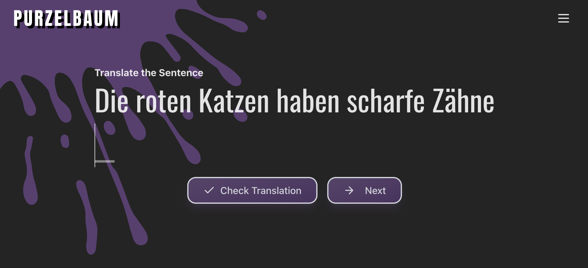

# Purzelbaum - German Learning with OpenAI



A language learning application that uses OpenAI to act as a digital teacher fixing your errors.

## Tech Stack

### Frontend

- React
- Jotai
- Tailwind CSS
- Vite
- PWA Support

### Backend

- Node.js
- Express
- OpenAI API

## Backend Setup local computer

Create a `.env` file in the `api` directory with the following content:

```env
PORT=3005
OPENAI_KEY=your_openai_api_key_here
```

Create a `env` file in the `frontend` directory with the following content:

```env
VITE_CLOUDFLARE_R2_SENTENCES_URL=https://identifier-numbers.r2.dev/filename.json
VITE_CLOUDFLARE_WORKER_URL=https://workerinstance-name.profile-name.workers.dev/

Start the development server:

```bash
cd api
npm install
npm run dev
```

The server will start on port 3005 by default.

## Frontend Setup on local computer

Create a `sentences.js` file in the `frontend/learning-material` directory based on the example file `sentences-example.js`.

```bash
cd frontend
npm install
npm run dev
```

The frontend will start on port 3000 by default.

## Production deployment

For production deployment I recommend you using

- Vercel for frontend
- Digital Ocean for the API
- Cloudflare R2 and Worker to provide the sentences or use Database for a more robust version

For R2 you may need a Worker, you can find an implementation here: `r2Worker/worker.js`.

Don't forget to set the `environmental variables` for both the UI and the API.

## API Endpoints

### OpenAI Analysis

- **POST** `/api/openai/analyze`
- **Body**: `{ "sentence": "Your German sentence here" }`
- **Response**: Analysis of the sentence

### Database

- **GET** `/api/database/hello`
- **Response**: Test message from the database

## Development

- Backend runs with hot-reload enabled (nodemon)
- Frontend runs with React's development server
- Both servers can run simultaneously on different ports
